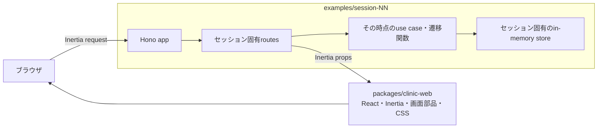
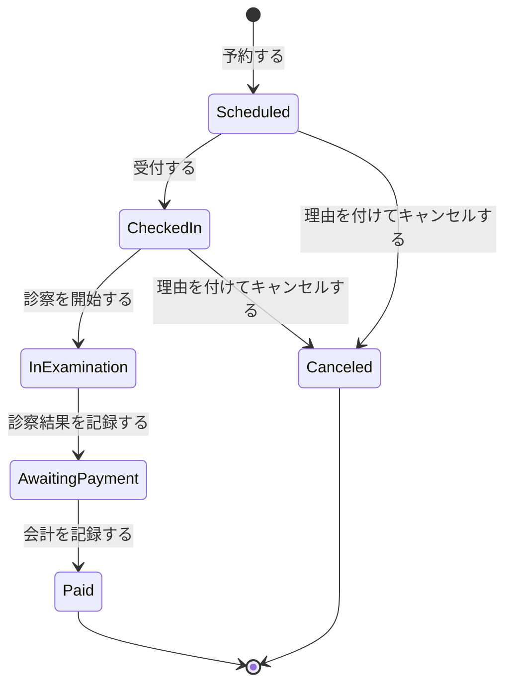
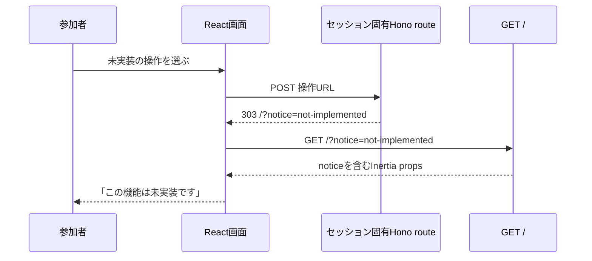

# 各セッションを実行可能なWebアプリケーションにする設計

- 日付: 2026-08-28
- 状態: レビュー待ち

## 背景

現在の `examples/session-00` と `examples/session-02` から `examples/session-07` は、TypeScriptのモジュールとテストとしては実行できますが、参加者がブラウザから操作できるサーバーサイドアプリケーションではありません。`examples/session-01` はREADMEだけを持ちます。Hono、Inertia、Reactを使って画面操作から業務処理まで接続しているのは `examples/final` だけです。

この構成では、Session 00で現行システムを観察すると説明しても、観察対象となるWebアプリケーションがありません。Session 02以降も、参加者が改善したドメインモデルやワークフローがHTTPリクエストを受けて画面へ結果を返すまでの流れを確認できません。Finalは完成したアプリケーションですが、各セッションの変更がFinalのどこへつながるのかを画面操作から追えません。

一方、各セッションは参加者間の差を持ち越さないため、毎回同じ配布スナップショットから開始する必要があります。セッション間でGitの差分を積み上げることは目的にしません。画面、URL、初期データ、業務の流れを揃えることで、操作体験の連続性を保ちます。

## 目的

- `examples/session-00` から `examples/session-07` を、それぞれ単独で起動できるHonoアプリケーションにします。
- 全セッションでInertia、React、画面部品、CSS、URL、初期データを揃えます。
- 各セッションのHono routesは、そのセッションのソースコードとして所有します。
- 参加者が改善するドメインモデルやワークフローを、Hono routeから実際に呼び出します。
- 未実装の操作を予期しない500として扱わず、トップページへ戻して「この機能は未実装です」とダイアログで伝えます。
- Session 02からFinalと同じ `AwaitingPayment` を導入し、診察結果を記録する前に会計できない状態遷移を表します。
- セッションごとの演習範囲、手順数、変更行数の上限を増やしません。
- 全セッションがデモ可能であることを、実装後にCIで検知します。

## 対象外

- Session 00からSession 07へ参加者の作業差分を持ち越す仕組みは追加しません。
- セッション用アプリへ認証、ユーザー管理、Drizzle、SQLite、監査画面を移植しません。
- Finalの全画面と全業務を各セッションへ複製しません。
- Hono routesや業務処理を一つの共通backendへ集約しません。
- React Routerや独立したREST APIは追加しません。
- セッションの演習対象をHono routesへ広げません。routesは演習対象の呼び出し側として参加者が読める状態にします。

## 採用する構成

共有する範囲を表示と実行基盤に限定し、業務処理との接続は各セッションに残します。



### 共通パッケージ

`packages/clinic-web` を追加し、次の責務だけを持たせます。

- `AppShell`、`Button`、`Surface`、`StatusBadge`、ダイアログなどのReact部品
- セッション用トップページと共通CSS
- Inertia propsとして使う画面向けの型
- React client entryとInertia page registry
- HonoへInertia middlewareとroot viewを設定する小さなhelper
- Vite設定を作るhelper
- 未実装操作のリダイレクト先とnotice codeを作るhelper

共通パッケージは予約の状態遷移、use case、store、Hono routeを持ちません。セッションのドメイン型をimportせず、画面表示に必要なDTOだけを受け取ります。

Finalの汎用React部品とCSSもこのパッケージへ移し、Finalとセッション用アプリが同じ表示基盤を利用します。Final固有のページ、認証、routes、use caseは `examples/final` に残します。

### セッション固有のアプリケーション

各 `examples/session-NN` は次の構成を持ちます。既存のドメイン、境界、use caseの配置は維持し、Webアプリケーション境界を追加します。

```text
examples/session-NN/
├── package.json
├── vite.config.ts
├── src/
│   ├── app.ts
│   ├── server.ts
│   ├── web/
│   │   ├── pageProps.ts
│   │   ├── appointmentView.ts
│   │   └── routes.ts
│   ├── adaptor/
│   │   └── inMemoryAppointmentStore.ts
│   ├── domain/
│   ├── boundary/
│   └── useCase/
└── test/
    └── web/
        └── clinicFlow.test.ts
```

`app.ts` は `new Hono()`、middlewareの設定、routeの登録、共通エラー境界を読み取れる大きさに保ちます。`routes.ts` はURL、入力、呼び出す業務処理、返すresponseを明示します。共通パッケージから `registerClinicRoutes` のような完成済みroute集合を提供しません。

Session 01もHonoアプリケーションとして起動できるpackageへ変更します。S1はコード編集を行わないため、業務実装はSession 00と同じlegacy版を持ちますが、routeと起動入口は `examples/session-01` 自身が所有します。

## 予約の状態遷移

画面で扱う通常経路をFinalと揃えます。



この状態遷移は次の不変条件を表します。

- 診察結果を記録するまで会計できません。
- `Paid` と `Canceled` から業務を再開できません。
- キャンセルできるのは `Scheduled` または `CheckedIn` だけです。
- キャンセルには理由が必要です。

Session 00とSession 01では、同じ状態名をlegacyの文字列として扱います。型は不正な状態や遷移を拒否しません。Session 02のstarterから `AwaitingPayment` を含む判別共用体を置きますが、starterの遷移関数は広い `Appointment` を受け取り、実行時検査と型アサーションに依存します。Session 03のS2解答で、次の遷移元と戻り値を型へ反映します。

```text
completeExamination: InExamination -> AwaitingPayment
recordPayment: AwaitingPayment -> Paid
```

`AwaitingPayment` は `examId` と `examinationCompletedAt` を必須で持ちます。Session 02では文字列として導入し、後続の識別子と境界の演習でFinalと同じ制約へ段階的に近づけます。

## URLと初期データ

全セッションで次のURLを揃えます。

```text
GET  /
POST /appointments/:appointmentId/check-in
POST /appointments/:appointmentId/start-examination
POST /appointments/:appointmentId/exam-results
POST /appointments/:appointmentId/payment
POST /appointments/:appointmentId/cancel
POST /follow-ups/request
POST /demo/reset
```

トップページには、現在の予約、状態、状態に応じた操作、実装状況を表示します。Finalの画面構成と配色を使いますが、認証や管理画面は表示しません。

初期データには既存の `examples/fixtures/clinic.ts` を使います。各セッションのin-memory storeは同じ予約ID、ペットID、飼い主ID、獣医師ID、検査ID、日時から初期状態を作ります。ドメイン型が異なるため、storeと初期値への変換は各セッションが所有します。

`POST /demo/reset` はstoreを初期状態へ戻し、トップページへ303でリダイレクトします。講師と参加者はサーバーを再起動せず同じデモを繰り返せます。

各セッションはport 3000を使い、一度に一つだけ起動します。セッションを切り替えてもブラウザのURLを変えずに比較できます。

## Inertia propsと操作の表現

操作をbooleanだけで表すと、「業務上実行できない」「権限がない」「まだ実装していない」を区別できません。画面向けの操作を判別共用体で表します。

```ts
export type ActionAvailability =
  | Readonly<{
      kind: "Available";
      href: string;
      method: "get" | "post";
    }>
  | Readonly<{
      kind: "NotImplemented";
      href: string;
      method: "get" | "post";
    }>
  | Readonly<{
      kind: "Hidden";
    }>;

export type AppointmentActions = Readonly<{
  checkIn: ActionAvailability;
  startExamination: ActionAvailability;
  recordExamResult: ActionAvailability;
  recordPayment: ActionAvailability;
  cancel: ActionAvailability;
  requestFollowUp: ActionAvailability;
}>;
```

- `Available` は、現在状態で許可され、セッション内に実装済みの操作です。
- `NotImplemented` は、画面には表示しますが、業務処理がまだ存在しない操作です。
- `Hidden` は、現在状態や権限上表示しない操作です。

画面の表示制御を認可や状態検査の代わりにはしません。直接HTTPリクエストを送られた場合も、各routeまたはuse caseが状態と入力を検査します。

## 未実装操作

未実装操作にもHono routeを登録します。routeが存在しない404や、未実装を示す500は返しません。



トップrouteは `notice` を許可済みのcodeとして検証し、画面へ次の値を渡します。

```ts
type Notice =
  | Readonly<{ kind: "FeatureNotImplemented" }>
  | Readonly<{ kind: "InvalidAppointmentState" }>
  | Readonly<{ kind: "AppointmentNotFound" }>
  | Readonly<{ kind: "AppointmentConflict" }>
  | null;
```

query parameterの文字列をダイアログ本文として表示しません。本文はReact側で固定します。ダイアログを閉じた後はInertiaの `router.replace("/")` でnoticeを取り除き、再読み込みで同じダイアログが開き続けないようにします。

全セッションで電話フォロー依頼を `NotImplemented` として表示し、`POST /follow-ups/request` からこの経路を確認できるようにします。Finalでは既存の電話フォロー業務をそのまま利用します。

GETの未実装ページからトップへ戻す場合は302を使えます。POSTなど状態を変更する可能性がある操作は、後続リクエストをGETに固定するため303を返します。

## セッションごとの接続

Webアプリケーションは、各演習の対象モジュールを次のように呼び出します。routes自体は参加者の編集対象にしません。

| 起動するpackage | routeから呼び出す実装 | 画面で確認すること |
| --- | --- | --- |
| `session-00` | legacyの `bookAppointment` と `updateStatus` | 任意の文字列状態と不正な戻り遷移が実行でき、PIIを含むログが出ること |
| `session-01` | S0と同じlegacy実装 | 現行操作を業務イベントとワークフローへ翻訳すること |
| `session-02` | 実行時検査と型アサーションを残した遷移関数 | Finalと同じ6状態を操作できるが、型が遷移元を狭めていないこと |
| `session-03` | S2解答の純粋な遷移と、S3 starterのraw ID | 不正な遷移は型で拒否できるが、用途の違うIDは区別できないこと |
| `session-04` | S3解答の用途別IDと、S4 starterの未検証入力境界 | IDは区別できるが、不正な外部入力とPIIログを止められないこと |
| `session-05` | S4解答のZod・`Sensitive` と、S5 starterの粗い失敗変換 | 入力とPIIは守れるが、異なる失敗を正確に利用側へ返せないこと |
| `session-06` | S5解答の同期 `Result` と、S6 starterの非決定値・2回保存 | 失敗は区別できるが、テストが安定せず状態と監査記録が片方だけ残り得ること |
| `session-07` | S6解答の `ResultAsync`、Clock、ID generator、event store | 状態と監査記録を一度に保存し、未知の障害だけを500へ送ること |

`session-03` から `session-07` には、前セッションの解答と現在のセッションで改善するstarterが同居します。routeは現在のstarterを呼び、参加者の変更を保存すると同じ画面操作の結果が変わるようにします。公開ページのセッション番号、README、テスト名では、参加者が実施するセッション番号を使います。

Session 02の状態追加に伴い、S2 starter、S3のS2解答、S4からS7の回帰、公開教材、型fixture、Web DTOを同期します。現在の「6つ目の状態を追加する」網羅性テストは、既存6状態に未知の状態を加える「7つ目の状態を追加する」テストへ変更します。

## エラー境界

未実装は業務エラーでも予期しない障害でもありません。専用の303リダイレクトとして扱います。

各セッションでまだ改善していない問題を共通基盤が先回りして隠さないようにします。

- legacyの不正な状態変更やPIIログは、S0とS1で再現可能なままにします。
- `session-02` の遷移関数に残る実行時例外は、教材どおり共通エラー境界まで伝播できます。
- `session-03` から `session-05` では、その時点の純粋遷移、入力境界、失敗型をrouteがそのまま使います。共通基盤が不正な入力や粗い失敗変換を補正しません。
- `session-06` では予期可能な失敗を `Result` の `kind` で分岐し、利用者が判断できる表示へ変換します。S6 starterの非決定値と2回保存はrouteから実行され、演習後に同じ操作で改善を確認できます。
- `session-07` では保存障害や破損データをcatchして業務エラーへ変えず、共通エラー境界が詳細を含まない500へ変換します。

共通エラー境界はスタックトレース、PII、自由記述、内部IDをHTTP responseへ含めません。教材でまだ扱っていない業務エラーを共通helperが推測して変換しません。

## 実行コマンド

各セッションpackageへ `dev`、`build`、`typecheck`、`test` を揃えます。ルートには講師と参加者が迷わず起動できるコマンドを追加します。

```text
pnpm demo:00
pnpm demo:01
pnpm demo:02
pnpm demo:03
pnpm demo:04
pnpm demo:05
pnpm demo:06
pnpm demo:07
```

既存の `exercise:02` から `exercise:06` は変更しません。Webアプリを起動しなくても演習テストを実行できる状態を維持します。

## テストとCI

テストは次の三層に分けます。

### 共通UIテスト

- `Available`、`NotImplemented`、`Hidden` が異なる表示になること
- `FeatureNotImplemented` のときだけダイアログが開くこと
- query parameterの任意文字列を本文へ表示しないこと
- ダイアログを閉じるとnoticeがURLから消えること

### セッションごとのWebテスト

Honoの `app.request` を使い、実際のportを開かずに次を確認します。

- `GET /` が200とInertia pageを返すこと
- 実装済み操作がセッション固有の業務処理を呼び、状態を更新すること
- 未実装操作が303でトップへ戻ること
- リダイレクト先のpropsに `FeatureNotImplemented` が含まれること
- `POST /demo/reset` で同じ初期状態へ戻ること
- 予期しない例外のresponseに内部情報が含まれないこと

S0では、会計済みを診察中へ戻せる事故とPIIを含むログを意図した再現テストとして分離します。通常テストは配布状態の健全性を確認し、事故が存在することを理由に失敗させません。

### CIへの追加

実装中は変更したpackageのWebテストを追加しながら進めます。すべてのセッションが起動可能になった後、CIの最後の段階で次をroot commandへ接続します。

- 全セッションのtypecheck
- 全セッションの通常テストとWeb smoke test
- 共通Web packageと全セッションのproduction build
- Finalと公開ドキュメントの既存テストとbuild

CIは一部のセッションだけを個別列挙しません。workspace filterまたは検査対象一覧を一箇所に置き、新しいセッションを追加したときに検査漏れが起きない構成にします。

## 移行順序

1. 共通React部品、CSS、画面向け型、ViteとInertiaのhelperを `packages/clinic-web` へ切り出します。
2. Session 00へHono app、routes、in-memory store、Webテスト、起動コマンドを追加し、事故をブラウザから再現できる状態にします。
3. Session 01を単独packageにし、Session 00と同じアプリケーションを起動できる状態にします。
4. Session 02へ `AwaitingPayment` と診察完了遷移を追加し、Session 03からSession 07へ解答と回帰を伝播します。
5. Session 02からSession 07へ、それぞれのドメイン、境界、use caseを呼ぶHono routesとWebテストを追加します。
6. 公開教材、README、起動案内、Mermaid、Code Explorerの参照範囲を同期します。
7. root scriptsとCIへ全セッションのtypecheck、test、buildを接続します。

Session 00の縦方向の一連の処理を先に完成させ、共有境界が妥当かを確認してから他のセッションへ展開します。全セッションへ空の雛形を一度に配りません。

## 検討した代替案

### Hono routesを共通化する案

共通routesがセッションごとのbackend interfaceを呼ぶ構成は、重複を最も減らせます。しかし、参加者が読むコードからHTTP入力、業務処理の呼び出し、response変換が消えます。サーバーサイドTypeScriptの教材として、ドメインモデルが実際のアプリケーション境界でどう使われるかを説明しにくいため採用しません。

### Finalアプリケーションを各セッションへ複製する案

各セッションが完全に自己完結しますが、認証、SQLite、管理画面、約600行の予約routeまで複製されます。教材と関係のない差分が増え、セッション間のずれを防ぐ保守コストも高くなるため採用しません。

### 共通UIと実行基盤だけを共有する案

React、Inertia、CSS、画面向け契約を揃えながら、Hono routesと業務処理の接続を各セッションへ残せます。routeの小さな重複は発生しますが、その重複は各スナップショットを単独で読めるようにするための教材上のコストです。本設計ではこの案を採用します。

## リスクと対策

### Webコードが演習差分を圧迫する

Webコードは配布済みの呼び出し側として追加し、参加者の編集対象と解答差分へ含めません。exerciseの対象ディレクトリと行数上限を維持します。

### 共通UIの変更が全セッションを壊す

画面向け契約の型検査、共通UIテスト、全セッションのWeb smoke testを組み合わせます。セッションのドメイン型を共通パッケージへ漏らしません。

### 未実装ダイアログが本来の事故を隠す

各セッションの学習対象となる操作は必ず実装します。`NotImplemented` はそのセッションの対象外に限ります。S0の不正遷移、S4の外部入力、S6のResultなど、セッションの核となる経路を未実装扱いにしません。

### routeの複製が同期されない

URLと画面向け契約を共通型で固定し、全セッションへ同じcontract testを適用します。routeの内部はセッションごとの教材実装に合わせて違ってよいものとして扱います。

## 受け入れ条件

- `examples/session-00` から `examples/session-07` の各packageを、対応する `pnpm demo:NN` で起動できます。
- 全セッションのトップページを同じURL、同じ初期データ、同じReact部品とCSSで操作できます。
- 各セッションが `new Hono()` とHono routesを自身のソースコードとして持ちます。
- Hono routesが、そのセッションのドメイン遷移、境界、use caseのいずれかを実際に呼びます。
- S0で会計済み予約を診察中へ戻す事故とPIIログをデモできます。
- S2からS7の予約状態が `AwaitingPayment` を含み、`InExamination -> AwaitingPayment -> Paid` を表します。
- 診察結果を記録していない予約を会計する呼び出しは、S2の解答以降でコンパイルできません。
- 未実装操作はトップへリダイレクトされ、「この機能は未実装です」とダイアログに表示されます。
- 未実装操作、業務上実行できない操作、画面に出さない操作をInertia propsで区別できます。
- 既存の `exercise:02` から `exercise:06` のREDと解答差分の上限を維持します。
- `pnpm typecheck`、`pnpm test`、`pnpm build` が全セッション、Final、公開ドキュメントを検査して成功します。
